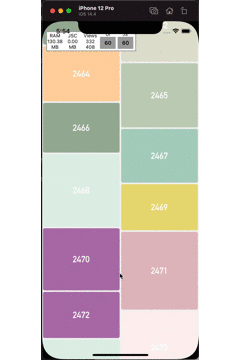

# react-native-waterfall-layout-list


waterfall-layout-list. based in react native VirtualizedList


<p align="center">

</p>


## Setup

This library is available on npm or yarn, install it with: `npm i react-native-waterfall-layout-list` or `yarn add react-native-waterfall-layout-list`.

## Usage

 This is a convenience wrapper around <VirtualizedList>, and thus inherits its props (as well as those of `<ScrollView>`)


1.  Import react-native-waterfall-layout-list:

```javascript
import WaterfallList from 'react-native-waterfall-layout-list';
```


## Example


```JSX
<WaterFallList
        renderItem={renderItem}
        data={data}
        windowSize={5}
        keyExtractor={(item, index) => `${index}`}
        onEndReached={loadMoreData}
        ListFooterComponent={<ListFooter />}
        numColumns={2}
        getHeight={getHeight}
      />
```

For a more complex example take a look at the `/Example` directory.

## Available props

| Name                           | Type             | Default                        | Description                                                                                                                                |
| ------------------------------ | -------------------- | ------------------------------ | ------------------------------------------------------------------------------------------------------------------------------------------ |
| getItemHieght                  | (item,index)=>number |                  | get list-item height  animation                                                                                                                       |
| numColumns            | number           | 1                            | like Flatlist props but waterfall(masonry) layouts are no supported                                                                                                |


Pull requests, feedbacks and suggestions are welcome!
